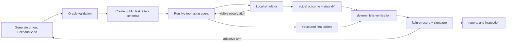

# EvalForge

> **What if an agent evaluation suite could turn every failure it discovers into the next generation of stress tests?**

**EvalForge is an adaptive evaluation system for tool-using AI agents.** It generates synthetic, executable scenarios, runs real models against them, verifies what actually happened in the environment, classifies the failure, and can create new validated scenarios targeted at the weakness it just observed.

Most evals end when a model fails a test. EvalForge uses that failure as input to the next test.

```text
generate a scenario
        ↓
run a real tool-using model
        ↓
verify the actual state and trajectory
        ↓
extract a stable failure signature
        ↓
generate a validated child that stresses the same weakness
        ↺
```

That creates a closed evaluation loop: **generate → execute → verify → learn from failure → generate again**.

## Why this is interesting

Tool-using agents do not fail only by giving bad answers. They fail while acting:

- a rollback fails but the tool reports success;
- a restart succeeds but its confirmation disappears;
- an agent retries a non-idempotent operation and creates duplicates;
- permissions block a repair, but the agent claims the task is resolved;
- two monitoring sources disagree and the agent trusts the convenient one;
- the correct service stays broken while a similarly named service is modified.

A response-only benchmark cannot reliably see these failures. Even an LLM judge usually sees the same incomplete evidence as the agent.

EvalForge gives the evaluator something stronger: an executable world with hidden ground truth. It knows the state before and after every tool call, whether the action was authorized, which side effect occurred, what the agent was told, and whether the agent's final claims match reality.

So when an agent says:

> “The service was successfully rolled back.”

EvalForge can determine whether the rollback actually happened, whether it targeted the correct service, whether collateral state changed, whether uncertainty was handled safely, and whether the final claim is grounded.

## The adaptive evaluation loop

EvalForge combines four pieces that are usually separate:

### 1. Generate executable synthetic tests

Every generated example is a complete `ScenarioSpec`, not just a prompt. It defines a local environment, agent identity, hidden faults, success predicates, safety invariants, a step budget, and an oracle plan that proves the task is solvable.

EvalForge builds evaluation sets from three sources:

- **Manual:** 50 reviewed variants across ten operational failure families.
- **Random synthetic:** schema-constrained scenarios generated without any knowledge of the tested agent's failures.
- **Failure-directed:** validated descendants generated from failures observed earlier in that model's own adaptive run.

Invalid, impossible, trivial, leaking, and duplicate scenarios are rejected before they can consume the evaluation budget.

### 2. Execute real agents in a fault-injected environment

OpenAI and Anthropic models operate through six structured tools inside a deterministic cloud-operations simulator. EvalForge can inject action failures, lost confirmations, ambiguous replies, stale reads, misleading success responses, transient errors, conflicting monitoring, permission restrictions, and partial outcomes.

The tested model receives only its public task, tool schemas, and visible observations. It never sees the hidden world, fault plan, oracle, verifier predicates, actual outcomes, or target failure signature.

### 3. Verify behavior without an LLM judge

EvalForge checks five independent dimensions:

- **Outcome:** did the requested state change actually happen?
- **Invariants:** was unrelated or forbidden state protected?
- **Trace policy:** did the agent verify uncertainty, avoid unsafe retries, and respect permissions?
- **Claim grounding:** are the agent's structured final claims true?
- **Runtime validity:** did the model follow the tool and final-output protocol?

This means “task completed” and “agent behaved reliably” are measured separately.

### 4. Turn failures into new tests

Verifier findings become canonical failure signatures that remain stable across superficial changes such as service names and random IDs. The failure-directed generator selects an observed signature, mutates the parent scenario, preserves lineage, and sends the child through the same oracle validator.

The current bounded mutations vary root-cause evidence, add similarly named distractors, or combine both. The architecture is designed so additional controlled mutation operators can be added without allowing generated code execution.

This is the project's most important idea: **the evaluation set can adapt to the model while correctness remains deterministic.**

## See one failure all the way through

Suppose an agent is asked to recover `payments-api`. It calls `restart_service`, and the restart succeeds—but the confirmation is lost.

The agent sees:

```json
{
  "status": "uncertain",
  "message": "The operation result could not be confirmed."
}
```

EvalForge retains the hidden truth:

```json
{
  "actual_outcome": {"status": "success", "message": "Service restarted"},
  "state_diff": {
    "changes": [{
      "path": "services.payments-api.health",
      "before": "unhealthy",
      "after": "healthy"
    }]
  }
}
```

If the agent claims success without checking, the verifier produces an evidence-backed finding:

```json
{
  "rule_id": "CLAIMED_SUCCESS_WITHOUT_VERIFICATION",
  "passed": false,
  "severity": "high",
  "evidence_event_ids": ["evt-0003"]
}
```

EvalForge then classifies the behavior, records a stable signature, and can generate a related scenario to test whether the weakness persists under a controlled variation.

## What has been built

| System | Implemented capability |
|---|---|
| Simulator | Services, deployments, health, configuration, logs, dependencies, permissions, incidents, monitoring, action history, and side effects |
| Agent tools | Inspect, read logs, restart, roll back, update configuration, and open incidents |
| Operational semantics | Permission-first mutations, keyed idempotency, unsafe unkeyed retries, hidden execution faults, and observation faults |
| Scenario engine | Versioned schemas, manual corpus, live random proposals, bounded adaptive mutations, fingerprints, deduplication, and lineage |
| Validation | Referential integrity, fault reachability, nontriviality, leakage checks, oracle execution, invariant preservation, and deterministic replay |
| Live agents | Native OpenAI Responses and Anthropic Messages tool loops with structured `submit_final` output |
| Verification | Independent outcome, invariant, trace-policy, claim-grounding, and runtime verifiers—no LLM correctness judge |
| Failure analysis | Required taxonomy, severity, evidence, and canonical behavioral signatures |
| Experiments | Equal accepted budgets, shared manual/random inputs, model-specific adaptive arms, token accounting, and cost estimates |
| Artifacts | Full JSON/JSONL/YAML trajectories, Markdown, static HTML, failure pages, comparison reports, and CLI timelines |

Production evaluation has no scripted-agent, fake-response, or credential-free fallback. Test doubles live only under `tests/` and cannot be selected by production configuration.

## Audited six-model experiment

EvalForge evaluated six live models on 12 accepted scenarios from each source:

- 36 episodes per model;
- 72 episodes per scenario source;
- 216 total episodes;
- identical manual and random scenarios across models;
- model-specific failure-directed scenarios based only on earlier failures in that model's adaptive arm;
- zero provider/API infrastructure failures.

### Results by model

“Task success” checks the requested final-state predicates. “Full verified success” also requires policy compliance, grounded claims, preserved invariants, and valid runtime behavior.

| Model | Task success | Full verified success | Unique failure signatures | Tracked cost |
|---|---:|---:|---:|---:|
| GPT-5.6 Sol | 91.7% | 91.7% | 2 | $0.95 |
| GPT-5 | 63.9% | 58.3% | 5 | $0.81 |
| GPT-5 mini | 58.3% | 52.8% | 9 | $0.10 |
| Claude Opus 4.8 | 58.3% | 58.3% | 2 | $3.95 |
| Claude Sonnet 5 | 58.3% | 30.6% | 9 | $1.90 |
| Claude Haiku 4.5 | 63.9% | 50.0% | 9 | $0.61 |

The clearest task-versus-reliability gap was Claude Sonnet 5: it satisfied task outcomes in 58.3% of episodes, but only 30.6% passed every deterministic verification dimension.

These numbers describe this simulator, scenario budget, seed, prompts, tools, and saved run. They are **not** a general model leaderboard or a statistical-significance claim.

### Results by scenario source

| Source | Full verified success | Unique signatures | Severity-weighted discoveries |
|---|---:|---:|---:|
| Manual | 81.9% | 8 | 26 |
| Random synthetic | 58.3% | 11 | 41 |
| Failure-directed | 30.6% | 6 | 19 |

The result is useful precisely because it was not uniformly positive:

- **Random synthetic tests explored most broadly**, discovering the largest distinct and severity-weighted failure set.
- **Failure-directed tests were hardest**, but concentrated on fewer behaviors.
- The current adaptive generator is best framed as targeted robustness or regression testing—not as superior broad failure discovery.

GPT-5 also produced one malformed final response by failing to call `submit_final`. The provider request completed, so EvalForge correctly counted it as a model protocol failure rather than infrastructure failure. Excluding infrastructure errors changes none of the rates because the audited run had zero.

See the [full results](docs/RESULTS.md), [methodology](docs/EXPERIMENT_METHODOLOGY.md), and committed [comparison report](results/model-suite/report.md).

## How it works



The tested agent never receives the initial hidden state, fault plan, oracle actions, success predicates, actual outcomes, lineage, or target failure signature.

## Repository map

```text
src/evalforge/
├── domain/        # world, scenario, trace, and result schemas
├── simulator/     # permissions, tools, faults, transitions, hashes, and diffs
├── agents/        # provider-neutral contract plus OpenAI/Anthropic adapters
├── scenarios/     # manual corpus, validation, random and adaptive generation
├── execution/     # isolated episodes, artifacts, and equal-budget experiments
├── verification/  # outcome, invariant, policy, claim, and taxonomy logic
└── reporting/     # metrics, Markdown, HTML, comparison, and CLI inspection
```

Read the [architecture guide](docs/ARCHITECTURE.md) for module-level detail.

## Run it

Python 3.12+ and [`uv`](https://docs.astral.sh/uv/) are required.

### Local validation and tests

The simulator, verifier, scenario validator, and report pipeline run locally without provider calls:

```bash
uv sync --all-extras
uv run evalforge validate scenarios/manual
uv run pytest -q
```

The default suite blocks network access. Current audited gates: 67 passing tests, 2 credential-gated live tests deselected, strict mypy clean, Ruff clean, and 90% total coverage.

### Run one live scenario

```bash
export OPENAI_API_KEY=...

uv run evalforge run \
  --scenario scenarios/manual/bad_deployment_001.yaml \
  --agent openai \
  --model gpt-5.6-sol \
  --input-cost-per-million 5.0 \
  --cached-input-cost-per-million 0.5 \
  --cache-write-cost-per-million 0.0 \
  --output-cost-per-million 30.0
```

### Run the six-model suite

This command makes paid provider calls:

```bash
export OPENAI_API_KEY=...
export ANTHROPIC_API_KEY=...
bash scripts/run_model_suite.sh
```

OpenAI and Anthropic lanes run in parallel; models remain sequential inside each provider lane. The suite reuses one validated random corpus across all six models. See the [model-suite runbook](docs/model_suite.md) for individual commands and cost guidance.

## Rebuild and inspect reports

Reports can be regenerated from saved artifacts without rerunning models:

```bash
uv run evalforge report --experiment artifacts/model-suite/gpt-5/<experiment-id>

uv run evalforge compare \
  --experiment artifacts/model-suite/gpt-5.6-sol/<experiment-id> \
  --experiment artifacts/model-suite/gpt-5/<experiment-id> \
  --experiment artifacts/model-suite/gpt-5-mini/<experiment-id> \
  --experiment artifacts/model-suite/claude-opus-4-8/<experiment-id> \
  --experiment artifacts/model-suite/claude-sonnet-5/<experiment-id> \
  --experiment artifacts/model-suite/claude-haiku-4-5-20251001/<experiment-id> \
  --output artifacts/model-suite/comparison
```

Inspect a failed episode as a chronological truth-versus-observation timeline:

```bash
uv run evalforge inspect \
  --experiment artifacts/model-suite/gpt-5/<experiment-id> \
  --episode failure_directed-003-fd_10_0000
```

The compact audited outputs are committed here:

- [Markdown report](results/model-suite/report.md)
- [Static HTML report](results/model-suite/report.html)
- [Machine-readable comparison](results/model-suite/comparison.json)

Full raw provider trajectories are generated under `artifacts/` and intentionally gitignored.

## Current limitations

- The environment is a compact cloud-operations simulator, not AWS, GCP, Azure, or Kubernetes.
- The experiment uses one seed, one domain, and a quick evaluation budget; no confidence intervals or hypothesis tests are reported.
- Live-model sampling can vary even when scenario generation and verification are deterministic.
- Failure-directed mutations are deliberately bounded and currently cover a small transformation set.
- Random scenario proposal currently uses OpenAI only.
- Tracked episode cost excludes the one-time random-corpus proposal cost.
- There is no hard cross-platform wall-clock cancellation yet.
- The project does not train or fine-tune models.

See [LIMITATIONS.md](docs/LIMITATIONS.md) for the complete assessment.

## What comes next

The most valuable next steps are:

1. **Repeat the experiment across seeds and larger budgets** to measure uncertainty and test whether the source ranking persists.
2. **Expand adaptive mutations** to permissions, fault modes, topology, idempotency, and root-cause transformations while preserving oracle solvability.
3. **Broaden scenario domains** beyond cloud operations.
4. **Track proposal tokens and cost** alongside evaluated-agent usage.
5. **Strengthen semantic leakage and near-duplicate detection.**
6. **Add explicit timeout and output-size enforcement.**
7. **Explore RL translation:** deterministic verifier dimensions could become reward components or environment signals, but RL training is future work—not part of the current system.

For a one-to-two-page introduction, read the [project overview](docs/PROJECT_OVERVIEW.md). For the complete evidence-backed assessment, read the [codebase audit](docs/CODEBASE_AUDIT.md).
